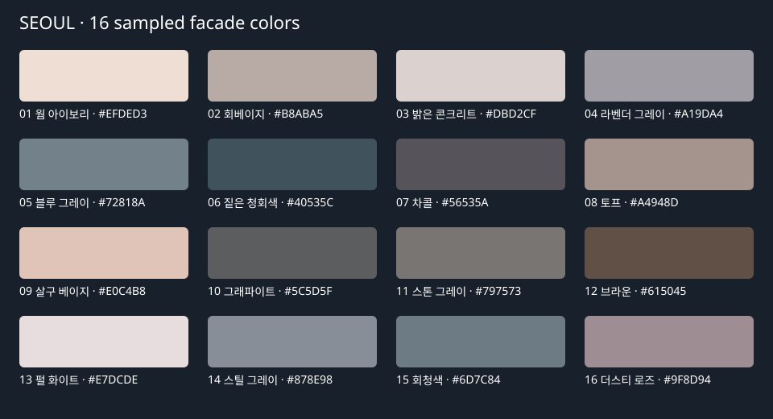

# 서울 도시 외관 1차 적용

서울 스트리밍 전장(seoul-stream)에 공통 외벽 셰이더를 적용한다. 그 외 도시는 기존 외관을 유지한다. 서울에서 로드되는 청크 전체에 적용하며 특정 실제 동네/건물 용도를 복원한 것은 아니다.

- 높이와 면적으로 저층 벽돌형, 아파트형, 업무시설형, 산업시설형 4종을 추정한다. 건물별 색 변주는 셀 좌표에 고정된다.
- 창문/층간 띠는 건물 로컬 미터 좌표에서 계산한다. 축소 시 미분 기반으로 세부 패턴을 줄여 원거리 깜빡임을 완화한다. 창문은 불투명한 푸른 유리색과 낮은 거칠기로 표현하며 내부 공간·실시간 반사는 없다.
- 옥상은 어두운 방수면 및 이음선으로 구분한다. 충분한 내부 공간이 있는 footprint 중앙에 1.8×1.2m, 높이 0.15m의 낮은 환기구 장식을 하나 추가한다. 이 작은 장식에는 별도 충돌을 추가하지 않는다.
- 환기구는 건물의 병합 정점 범위에 포함되어 붕괴/매몰/피격 색 변화에 함께 참여한다. 기존 footprint와 옥상 충돌 높이는 유지한다. 랜드마크는 식별 색상과 기존 외형을 유지한다.
- 별도 창문 메시·추가 드로우콜을 만들지 않는다. 건물 정점당 20바이트의 패턴 속성과 환기구당 36정점을 추가한다. 실제 성능 비용은 동일 카메라/구역 비교가 필요하다.

구현: BuildingFacade.ts(외관 분류/장식/재질), chunkMesh.ts(병합 통합), StreamingWorld.ts(서울 적용).

검증: 청크/건물 전투/외관 38개 테스트 통과. 환기구 포함 붕괴가 옆 건물 정점을 손상하지 않으며, 충돌 높이가 그대로 유지되는 것을 검사했다. 이동 원점에 따른 패턴 좌표는 부동소수점 허용 오차 내에서 유지된다.

다음 단계: 동일 구역 전후 성능 비교, 외벽 환경 반사와 조명 조정, 도심 포장/보도 표현. 현재 녹색 바닥과 단색 하늘은 이번 범위에 포함하지 않는다.

## 표면 텍스처

콘크리트, 붉은 벽돌, 녹색 옥상 방수면에 각각 1024×1024 색상·노멀·거칠기 PNG를 적용한다. 실제 사진을 복사하지 않은 자체 절차 생성 에셋이며 `node scripts/generate-city-textures.mjs`로 재생성한다. 원본은 public/textures/city/seoul에 보관한다.

콘크리트와 옥상은 4×4m, 벽돌은 1.92×1.76m마다 반복한다. 색상은 sRGB, 노멀과 거칠기는 선형 데이터다. 창문에는 벽 요철을 적용하지 않으며 유리 거칠기를 별도로 유지한다. 랜드마크와 환기구에는 이 텍스처를 적용하지 않는다.

서울 건물 재질이 처음 렌더링될 때 로딩하며 청크 사이에서 공유한다. 밉맵과 이방성 필터링을 사용한다. 9장으로 인한 텍스처 메모리와 픽셀 처리 비용은 추가되며, 저사양 기기의 별도 성능 검증은 필요하다. 이 단계는 표면 재질의 초안이며 사진 수준의 도시 복원이나 조명 개선을 포함하지 않는다.

## 사진 기반 건물 팔레트 (16색)

[서울 전경 사진 — Tranmautritam, 2016-11-11](https://commons.wikimedia.org/wiki/File:Seoul_Buildings_city_view_366107.jpg)에서 눈으로 고른 외벽·유리면 16개 영역의 RGB 채널별 중앙값을 추출했다. 하늘과 수목 영역은 제외했다. 이는 촬영 당시 조명·안개·그림자가 포함된 사진상의 색이며 측정된 실제 도료의 반사율은 아니다.

정확한 원본 좌표, 샘플 픽셀 수, 출처, HEX는 `src/world/seoulFacadePalette.json`에 기록한다. 원본 사진은 배포하지 않으며 게임에는 16개 색상값만 포함한다. 원본 크기 JPEG로 `pwsh -File scripts/sample-city-facade-colors.ps1 -ImagePath <사진 경로>`를 실행하면 같은 색을 다시 추출할 수 있다(Windows).

서울 일반 건물은 높이별 4색 대신 이 16색 중 하나를 절대 좌표 기반 해시로 고른다. 팔레트 밖으로 색이 바뀌는 HSL 지터는 제거했다. 청크 재로딩과 이동 원점 변경에도 같은 건물의 색은 유지된다. 건물 용도별로 한 색에 몰리지 않도록 16색을 공통 사용한다. 랜드마크 식별색은 기존대로 유지한다.

외벽 텍스처는 원래의 붉은색/베이지색을 다시 곱하지 않고 상대 밝기와 요철·거칠기로 사용한다. 유리에도 건물색을 일부 반영하여 유리 비중이 큰 건물의 색 차이를 살린다. 최종 화면의 밝기는 게임 조명과 톤매핑에 따라 달라진다.

## 도로·보도·조명 개선

스트리밍 도시의 지형 표면에 짙은 아스팔트, 회베이지 포장, 연석 색 경계를 추가했다. 폭 6~24m 도로에는 양쪽 약 2.3m 보도를 추정해 그린다. 실제 보도 데이터 복원은 아니며, 별도 높이·충돌은 없다. 간선도로(16m 이상)에 황색 중앙선, 22m 이상에는 백색 점선을 추가한다. 교차로 신호/횡단보도/실제 차로 수는 추정하지 않는다. 모든 보도 바탕을 먼저 그리고 도로를 덮어 교차로 차도를 연결한다.

StreetSurface.ts에서 가까운 아스팔트 입자와 60×40cm 보도 줄눈을 미터 좌표로 표현하며, 화면에서 작아지면 미분 기반으로 세부 패턴을 줄인다. 추가 표면 텍스처나 도로 메시 없이 기존 청크의 1024px 표면 텍스처를 재사용한다. 경계의 정밀도는 기존 베이크 해상도에 제한된다. 별도 마스크 대신 표면색을 판별하므로 베이크된 경계에서는 세부 질감이 완화된다.

공통 조명은 지면 반사색을 중성 회갈색으로 바꿔 녹색 색번짐을 줄이고, 반구광 1.35 / 태양광 1.2 / 보조광 0.35로 설정했다. 태양 고도를 높이고 그림자 바이어스를 조정했다. 기존 하늘·포그 색과 노출은 유지한다. 새 도로/보도 배경을 시인성 테스트에 포함했으며 관련 53개 테스트가 통과했다. 픽셀 단위 재질 표현의 성능은 기기별 검증이 필요하다.

## 밀집 지역 밝기 보정 — 현재 적용값

이 절은 앞선 16색 균등 배정 설명을 대체한다. 사진 원본 RGB는 seoulFacadePalette.json에 그대로 보관하고, 렌더링 팔레트는 중성화 및 밝기 보정을 거친 16색으로 분리한다. 밝은 네 색의 선택 가중치는 합계 67%이며 어두운 색은 포인트로 남긴다. 이는 사진의 실제 도료 반사율 측정치가 아니라 게임용 보정이다.

지붕에는 외벽과 독립적으로 회색·회녹색·청회색 계열 5색을 배정한다. 방수면 텍스처는 평균 밝기로 정규화해 표면 변화만 곱하므로 외벽색×어두운 방수면색의 이중 감광을 제거한다. 별도 재질/메시를 늘리지 않고 지붕 정점색을 사용하여 피격 색 변화·붕괴 시스템에 계속 참여한다. 랜드마크 식별색은 유지한다.

외벽 하단 감광 최솟값 .73→.9, 층간 띠 감광 .13→.07로 줄이고 유리는 외벽 의존도를 낮춰 어두운 외벽과 함께 검게 뭉치는 현상을 완화했다. 전체 노출·공통 조명은 이번 단계에서 변경하지 않았다.

동일 서울 79/47 청크 2,894동 확인: 밝은 네 색 1,913동(66.1%, 이전 727동/25.1%), 외벽 배정색과 병합 정점색 불일치 0. 내려다보는 시점에서 지붕의 검은 덩어리가 줄어든 것을 확인했다. 기존 53개 관련 테스트와 타입 검사를 통과했다. 녹색 빈 지면·단순한 건물 형상·대기감은 아직 실제 사진과 차이가 있다.

## 창문 대비와 반복감 완화

창문색을 외벽색에 가깝게 혼합해 밝은 벽 위의 어두운 격자 대비를 낮췄다. 건물의 절대 좌표에서 만든 고정 변주값으로 창 간격·층 간격·창 크기·가로 시작 위치·명암을 다르게 한다. 재로딩과 원점 이동으로 패턴이 바뀌지 않는다. 정점당 4바이트 변주 속성이 추가되며 드로우콜은 늘지 않는다.

화면상 창 패턴이 작아지면 색 대비를 낮춰 원거리 반복을 완화하고, 층간 띠 감광도 .07→.035로 줄였다. 유리 거칠기는 .5로 높여 반짝이는 반복도 억제한다. 서울 밀집 청크의 낮은 시점에서 시각 확인 및 렌더링 오류 없음, 관련 38개 테스트 통과.

## 지붕 중앙 장식 제거

지붕 가운데 자동 생성하던 사각 환기구 메시를 제거했다. 외벽/지붕 텍스처와 색상은 유지하며 건물 외형 정점 수는 원본 압출 메시와 같다. 앞선 절의 환기구 및 추가 36정점 설명은 이전 구현 기록이다. 붕괴 범위·충돌 관련 38개 테스트와 타입 검사가 통과했다.

## 지도 기반 도심 바닥 — 서울 1차

UrbanGround.ts에서 기존 건물 footprint 둘레 6m를 회색 포장면으로 추정하여 좁은 건물 사이 공간을 연결한다. 실제 공원/잔디/숲/운동장/포장 폴리곤을 그 위에 반영하고, 마지막으로 수역과 기존 도로를 그린다. 녹지는 포장보다 우선 복원하여 공원 안 건물의 주변 포장 추정이 공원 전체를 덮지 않도록 한다. 지정된 수목 구역은 잔디보다 짙은 색으로 구분한다.

서울 상세 외관이 켜진 청크에만 적용하며 원본 지도 파일은 변경하지 않는다. 건물 근처의 포장 범위는 추정값으로 실제 필지/주차장/출입구를 복원한 것이 아니다. 지도 정보가 없는 넓은 빈 땅은 기존 지형색을 유지한다. 지형 베이크를 재사용하므로 추가 지형 메시/충돌/텍스처 메모리는 없고 청크 생성 시 폴리곤 그리기 비용만 추가된다. 청크 바깥 건물 정보는 사용하지 않으므로 경계 인접 추정 포장에는 제약이 있다.

서울 79/47 청크의 건물 2,894동 및 공원 11개·잔디 23개·숲 17개·포장 17개·운동장 3개 영역을 사용한 화면에서 확인했다. 관련 테스트 53개 통과.

## 건물 종류별 입면 구분

저층 중 일부에 상가층 쇼윈도와 낮은 대비의 간판 띠, 나머지에는 출입구 표현을 추가했다. 아파트형은 7~11m 간격의 약한 세로 구획, 오피스형은 10~15m 간격의 수평 띠, 산업시설형은 하역문 표현을 사용한다. 기존 높이/면적 기반 분류이므로 실제 용도·출입구 방향을 복원한 것은 아니다. 출입구는 표현용이며 실내 진입 기능은 없다.

이번 단계는 입면 재질 개선이다. 건물 체적·충돌·옥상 형상은 그대로이며 추가 메시/드로우콜 없이 셰이더로 표현한다. 원거리에서는 디테일을 완화하고 연한 창문은 유지한다. 실제 서울 밀집 청크와 별도 유형별 배치 화면에서 렌더링 오류가 없는 것을 확인했으며 관련 38개 테스트와 빌드가 통과했다.

## 지도 기반 가로시설

서울 상세 청크에 도로변 가로등과 가로수를 추가한다. 폭 6~24m 도로 옆 1.4m 지점을 후보로 하고, 건물 여유 영역·다른 도로의 차도·수역·청크 가장자리를 제외한다. 후보가 지도상의 공원/숲/정원/잔디 안에 있으면 나무, 그 외에는 가로등을 배치한다. 실제 시설물 위치의 복원이 아닌 지도 기반 추정이다.

45m 간격 후보를 고정 해시로 선택해 최소 14m 간격, 청크당 최대 48개를 유지한다. 최대 3개 공유 재질 메시로 병합하며 청크와 함께 해제한다. 나무는 약 5.5m, 가로등은 6m 규모의 초안이다. 장식용으로 별도 충돌/야간 광원/파괴 기능은 없다. 서울 79/47에서는 나무 5개와 가로등 43개가 배치됐다. 비교 페이지에 가로수/가로등 근접 확인 버튼을 추가했다.

배치 제외·개수 제한 관련 신규 검사 및 청크/외벽 검사 총 35개 통과. 렌더링 오류 없음. 다수 청크에서의 그림자/드로우콜 비용은 후속 성능 확인 대상이다.

## 도시별 설정 분리
도시 프로필의 구성 및 새 도시 추가 방법은 [city-profiles.md](city-profiles.md)를 참고한다. 서울의 외벽/지붕/가로시설/지면/환경 설정은 src/world/cities/seoul.ts에서 관리한다.

## 도로 윤곽 메시
서울 프로필의 `street.geometry: true`가 도로/보도/경계선/차선을 별도 면으로 그린다.
다른 도시는 이 옵션을 켜서 같은 방식을 선택할 수 있다. 색상은 각 도시 street 설정을 따른다.
저해상도 지형 텍스처에 도로를 중복으로 그리지 않으므로 바깥쪽 번짐이 남지 않는다.
도로의 중심선과 폭에서 둥근 끝의 윤곽을 만들고, 지형의 실제 삼각형 각각에 잘라 붙인다.
바이리니어 높이와 삼각형 표면의 차이 때문에 도로가 묻히거나 떠 보이는 문제를 피한다.
차도가 모든 보도/경계선보다 위에 그려져 교차로를 가로지르는 경계선이 남지 않는다.
실제 높이는 지형과 같고 polygon offset으로 겹침을 처리한다. 돌출 경계석이나 충돌 변화는 없다.
청크당 최대 6개 메시이며 청크 언로드 시 해제된다. 별도 근거리 LOD는 아직 없고 기존 청크 스트리밍 범위를 따른다.
아스팔트 입자와 보도 타일은 월드 좌표를 사용하며 원거리에서 약해진다.
차선은 기존 폭 기준으로 추정하며 교차로의 정지선/횡단보도/차선 연결 설계는 별도 작업이다.
검증: 지형 삼각형 밀착/청크 밖 잘라내기/상향 면/원점 변경/교차로 레이어/잘못된 선분 테스트.

## 경계석·교차로·아스팔트 후속 개선
서울 street 설정에 curbHeight=.12, junctionMarkings=true, wearStrength=.07을 추가했다.
asphalt는 #363a3f에서 #555b61로 밝게 바꿨다. 다른 도시는 해당 옵션을 독립 설정할 수 있다.
- 경계석은 노출된 차도 경계에 높이 12cm/폭 약20cm로 생성한다. 인접 도로 내부의 구간은 제외한다.
  상면은 실제 지형 삼각형으로 잘라 올리고 측면을 채운다. 충돌/이동 높이는 변경하지 않는다.
- 비평행 도로의 실제 선분 교차를 탐지한다. 차선은 교차부와 횡단보도 앞에서 끊는다.
- 폭 6~24m 도로의 충분한 길이가 있는 진입부에 폭3m 횡단보도와 우측통행 기준 진입 차로 정지선을 그린다.
  평행 도로 연결에는 생성하지 않으며, 짧거나 다른 교차로와 겹치는 진입부는 생략한다.
- 교차점 및 폭에서 추정하는 표현이다. 신호체계, 보행 수요, 고가도로 높이별 연결 여부는 원본 선분에 충분한 정보가 없어 재현하지 않는다.
- 아스팔트의 드문 보수 흔적은 최대7% 어두운 저대비 패턴이다. 원거리에서 사라진다.
- 도로 지오메트리는 청크당 최대7개 메시(경계석 포함). 공간 인덱스로 인접 도로를 조회한다.
  고속 이동 성능과 별도 도로 LOD는 다음 검증 항목이다.
검증: 평행/직교/사선 교차 탐지, 교차로 내부 차선/경계석 배제, 경계석 높이, 서울 아스팔트 색상 및 기존 지형 밀착 테스트.
서울 비교 페이지에 '교차로 가까이' 버튼을 추가했다.

## 최종 화면 윤곽 보정
공통 createComposer의 OutputPass 뒤에 FXAA(EdgeAntialiasPass)를 추가했다.
기존 WebGLRenderer의 antialias 옵션은 후처리용 렌더타깃에는 적용되지 않아
건물/차선/드론 실루엣에 남던 계단 현상을 최종 화면에서 완화한다.
전체 화면 가우시안 블러나 블룸 증가는 사용하지 않는다. HTML HUD에는 영향을 주지 않는다.
Composer가 전달하는 실제 픽셀 크기를 사용해 창 크기/DPR 변경 시 보정 간격을 갱신한다.
게임/인트로/메뉴 배경 및 서울 검토 페이지의 공통 후처리에 적용된다.
직접 렌더링하는 별도 워커/플라이어 모델링 페이지는 기존 기본 프레임버퍼 AA를 유지한다.
서울 검토 페이지에서 '윤곽 보정 켜기/끄기'로 같은 시점에서 비교할 수 있다.
정지 화면 계단 현상 완화이며, 이동 중 모든 반짝임을 해결하는 시간축 AA는 아니다.
